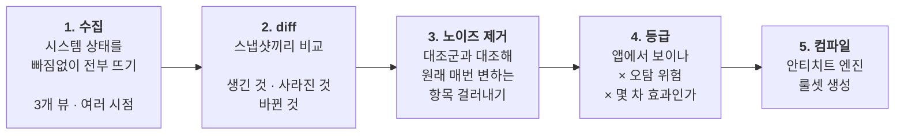
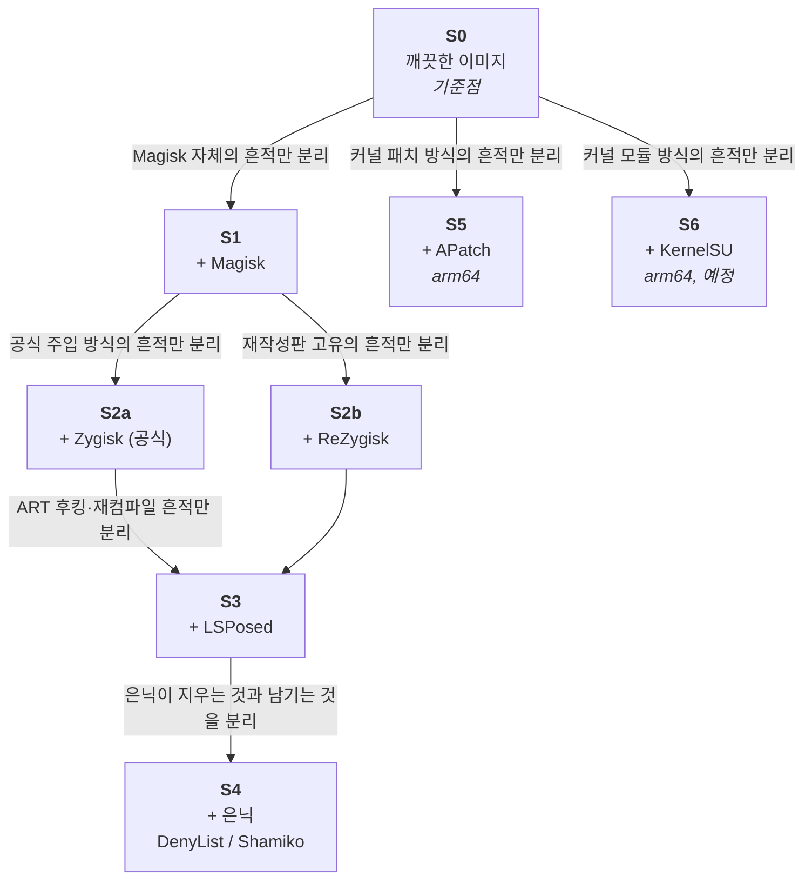

[English](README.md) · **한국어**

# Tidemark

> 시스템 전체 스냅샷을 통째로 비교해 도출하는 안드로이드 루팅·후킹 탐지 시그니처 — 은닉 프레임워크가 지울 수 없는 2차 파급효과를 노린다.

**상태: 구현 이전 단계.** 설계를 확정하는 중이며 수집기·분석기·오케스트레이터는 아직 만들지 않았습니다. [로드맵](#로드맵) 참고.

---

## 이름의 유래

Tidemark는 물이 빠진 뒤 해안에 남는 **흔적선**을 뜻합니다.

루팅 프레임워크는 물러나기 위해 상당한 공을 들입니다. 대상 프로세스가 보기 전에 마운트를 지우고, 덮어썼던 프로퍼티를 원래 값으로 되돌리고, SELinux 뒤로 파일을 숨깁니다. Tidemark는 그렇게 물러난 자리에 남는 선을 찾습니다.

---

## 핵심 명제

보통의 루팅 탐지는 루팅 프레임워크가 **직접 쓴** 흔적을 확인합니다. `PATH`에 놓인 `su`, `/data/adb/magisk`, 알려진 패키지명, 알려진 데몬. 이것들을 **1차 흔적**이라고 부르겠습니다. 그리고 이것들은 Zygisk DenyList·Shamiko·ReZygisk stealth·Hide My Applist 같은 은닉 도구가 지우려고 만들어진 바로 그 대상입니다.

**은닉 도구는 자기가 썼다는 걸 아는 것만 지웁니다.** 자기가 쓰지 않은 건 지울 수 없습니다.

자기가 쓰지 않은 것이 바로 **운영체제의 반응**입니다.

- zygote에 주입하면 이 기기의 모든 앱을 fork하는 단 하나의 프로세스가 흔들립니다. 거기서 생긴 흔적은 그 아래 모든 프로세스가 물려받고, 탐지기가 도는 프로세스도 예외가 아닙니다.
- SELinux 정책을 실행 중에 패치하면, 어떤 프로세스든 해시를 계산할 수 있는 정책 데이터 덩어리가 바뀝니다.
- ART를 후킹하면 재컴파일이 일어나고, 앱이 **자기 자신에 대해** 읽을 수 있게 허용된 OAT 파일의 헤더가 다시 쓰입니다.
- `/system` 위에 다른 파일을 덮어씌우면, 그 파일이 **어느 파티션에 들어 있는지를 나타내는 번호**가 `/data` 것으로 바뀝니다. `/system` 경로에 있는데 소속은 `/data`라는 건 앞뒤가 안 맞습니다. 특별한 권한도 전용 API도 없이, 앱이 파일 정보를 한 번 읽는 것만으로 드러납니다.
- 숨기려고 마운트를 지워도, 그때 써버린 mount ID 번호는 돌아오지 않습니다. 정상 기기는 번호가 촘촘히 차 있는데 중간이 통째로 비어 있다면, **걸었다가 지웠다**는 뜻입니다.

이 중 어느 것도 루팅 프레임워크가 작성한 게 아닙니다. 전부 **결과**일 뿐입니다. Tidemark는 그 결과들을 감이 아니라 체계적으로 찾아내기 위한 파이프라인입니다.

---

## 방법론

이 프로젝트의 중심 원칙은 **전수 캡처(total-surface capture)** 입니다. 검사할 대상을 고르지 않고, 시스템 상태를 **빠짐없이 통째로** 뜬다는 뜻입니다.

확인할 경로와 프로퍼티를 손으로 적어두면, 결국 **자기가 이미 아는 것만** 목록에 들어갑니다. 그런데 이 프로젝트가 찾으려는 건 아무도 몰랐던 파급효과입니다. 손으로 적은 목록으로는 원리적으로 찾을 수 없습니다.

그래서 Tidemark는 특정 항목을 찍어서 검사하지 않고 **도메인 전체를 열거**합니다. 마운트된 모든 파일시스템을 전부 훑고, 프로퍼티는 값과 함께 변경 카운터(serial)까지 전부 뜨고, 볼 수 있는 모든 프로세스의 `mountinfo`를 뜨고, 커널 집계 숫자와 ART 컴파일 상태를 뜹니다.

**무엇이 시그니처 후보인지는 사람이 미리 적어둔 검사 목록이 아니라, 두 스냅샷을 비교한 diff 결과가 결정합니다.**

이 원칙에서 네 가지가 따라 나옵니다.

| 원칙 | 이유 |
|---|---|
| **파일·프로세스뿐 아니라 집계 숫자도 뜬다** | 어떤 파급효과는 개체를 하나도 남기지 않고 **숫자만 어긋난 형태**로 존재합니다 — 남은 inode 수, slab 개수, mount ID 최댓값. 마운트를 걸었다가 지우면 마운트는 사라지지만, 그때 써버린 mount ID 번호는 돌아오지 않습니다. 파일과 프로세스를 아무리 열거해도 이런 건 안 나옵니다. |
| **한 번이 아니라 시간을 두고 여러 번 뜬다** | 파급효과는 몇 분에 걸쳐 나타납니다. `dex2oat`는 늦게 돌고 프로파일은 기기가 쉬는 동안 기록됩니다. 부팅 직후 한 번만 떠서는 *원래 없는 것*과 *아직 안 생긴 것*을 구분할 수 없습니다. |
| **앱을 실제로 돌려본다** | 어떤 상태는 후킹 프레임워크 아래에서 앱이 실제로 실행돼야만 생깁니다. 가만히 둔 기기에서는 영원히 나타나지 않습니다. |
| **추가된 것뿐 아니라 사라진 것도 찾는다** | 은닉은 지우는 행위입니다. 추가된 항목만 보는 diff 도구는 가장 믿을 만한 증거를 구조적으로 놓칩니다. |

---

## 파이프라인

**세 군데에서 동시에 수집합니다.** *어디서 관측할 수 있는가*와 *탐지기가 실제로 도는 자리*가 다르기 때문입니다.

| 뷰 | 관측 지점 | 목적 |
|---|---|---|
| `root_view` | 기기 안, 관리자 권한 | **채점 기준.** 루팅 도구가 바꾼 것 전부가 여기 다 보인다 |
| `app_view` | 일반 앱 프로세스 | **실제 답안.** 출시되는 탐지기가 이 중 몇 개나 볼 수 있는지 |
| `host_offline_view` | 호스트 쪽에서 디스크 이미지·게스트 RAM 직접 분석 | 기기를 건드리지 않고 관측. 가상 디바이스에서만 가능 |

채점 기준과 실제 답안의 **차이 그 자체가 중요한 산출물**입니다. 루팅 도구가 바꾼 건데 앱에서는 안 보이는 항목들 — 그게 곧 **지금 은닉이 성공하고 있는 범위**를 정확히 보여주는 지도이기 때문입니다.

이 둘은 *하나의* Rust 코어를 두 형태 — 정적 바이너리와 JNI 라이브러리 — 로 빌드해서 만듭니다. 파서를 따로 두 벌 작성하면 그 사소한 차이가 **실제 변화가 아닌 가짜 diff**로 나타나는데, 이게 우리가 찾는 미약한 2차 신호와 구분이 안 됩니다. 그래서 코어 공유는 편의가 아니라 정확성 요구사항입니다.

---

## 상태 사다리

`clean` 대 `rooted` 두 상태만 비교하면 서로 다른 원인들이 뒤섞입니다. Tidemark는 **바로 옆 단계끼리만 diff를 떠서** 각 단계가 한 가지 원인만 분리하게 합니다.

`S2a`와 `S2b`를 일부러 나란한 두 갈래로 뒀습니다. ReZygisk는 은닉 방식이 다른 재작성판이라, 공식 Zygisk에서 뽑은 시그니처가 그대로 통할 거라고 가정하면 맹점이 생깁니다.

---

## 아키텍처

첫 커밋부터 **서로 독립적인 두 축**을 둡니다. 한쪽을 늘려도 다른 쪽 코드를 고칠 필요가 없다는 뜻입니다.

**Backend** — 어디서 돌릴 것인가:

| Backend | 호스트 | 강점 | 약점 |
|---|---|---|---|
| `avd` | Windows / Linux x86_64 | 스냅샷 복원이 안정적 ⇒ 재부팅 노이즈가 매우 적음 | 기본 상태부터 이미 실기기와 다름, goldfish 커널 |
| `cuttlefish` | Linux **arm64** (라즈베리 파이) | GKI 커널이라 실기기에 가깝고, 부트 이미지 교체를 정식 지원 | 스냅샷 복원이 아직 불안정 |
| `qemu` | Linux arm64 | 커널·부트 이미지를 가장 자유롭게 건드릴 수 있음 | 손이 가장 많이 감 |

**RootTool** — 무엇을 설치할 것인가: `magisk`, `zygisk`, `rezygisk`, `lsposed`, `apatch`, `kernelsu`.

두 축은 자유롭게 조합됩니다. 백엔드를 새로 추가해도 루팅 도구 코드는 그대로고, 도구를 추가해도 백엔드 코드는 그대로입니다.

`arch`는 나중에 붙이는 항목이 아니라 **모든 스냅샷이 반드시 갖는 필수 필드**입니다. 시그니처가 아키텍처를 넘어가면 그대로 통하지 않기 때문입니다 — OAT 파일에는 ISA 필드가 박혀 있고, 라이브러리 경로가 다르고, `ptrace` 주입 방식이 달라서 **주입 흔적의 생김새 자체가 아키텍처마다 다릅니다.**

그래서 두 번째 아키텍처는 단순한 포팅이 아니라 **검증 수단**이 됩니다.

- 두 아키텍처에서 **똑같이 나온** 시그니처 → 아키텍처와 무관하게 성립, 신뢰도 최상
- **한쪽에서만 나온** 시그니처 → 그 아키텍처 전용, 조건부로만 적용

같은 논리가 백엔드에도 적용됩니다. 노이즈가 적은 `avd`에서 미약한 신호를 발굴하고, 실기기에 가까운 `cuttlefish`에서 그게 진짜인지 확인합니다. 한쪽 백엔드만으로는 이 구분이 불가능합니다.

---

## 가상 디바이스만 쓴다 — 의도된 맞바꿈

Tidemark는 가상 디바이스에서만 동작합니다. 이건 범위를 정한 결정이고, 실제로 얻지 못하는 시그니처가 생깁니다.

- verified boot 상태, 부트로더 잠금 상태, `dm-verity` 상태를 볼 수 없습니다
- 실기기에서 가장 강력한 신호인 **하드웨어 기반 키 어테스테이션**이 아예 없습니다
- 오탐률을 검증할 실기기 표본이 없습니다

이 한계는 덮어두지 않고 문서로 남깁니다. 대신 얻는 이점이 이 프로젝트의 목표와 정확히 맞물립니다. **스냅샷을 복원하면 매번 거의 완전히 똑같은 상태에서 다시 시작할 수 있다**는 점입니다.

실기기에서는 재부팅할 때마다 생기는 자잘한 변화가 쌓여서, Tidemark가 찾으려는 바로 그 미약한 2차 효과를 덮어버립니다. 1차 흔적을 쫓는 프로젝트라면 실기기가 나았겠지만, 이 프로젝트에서는 그 자잘한 변화를 없애는 쪽이 더 값어치가 큽니다.

---

## 저장소 구조

| 디렉터리 | 언어 | 역할 |
|---|---|---|
| `collector/` | Rust | 시스템 상태를 빠짐없이 뜨는 수집기 코어. `root_view`는 정적 바이너리, `app_view`는 JNI 라이브러리로 빌드 |
| `agent-app/` | Kotlin | `app_view` 수집기를 담는 얇은 APK |
| `analyzer/` | Python | diff, 자연 변동분 제거, 몇 차 효과인지 판정, 등급 부여. DuckDB + Parquet (스냅샷이 수백 GB까지 늘어남) |
| `orchestrator/` | Python | 백엔드·루팅도구 드라이버, 상태 사다리 자동화 |
| `signatures/` | — | 등급이 매겨진 시그니처 산출물 |
| `corpus/` | — | 스냅샷 저장소 (git 제외) |
| `docs/` | — | 설계 문서 |

---

## 로드맵

- [ ] 무엇을 어떻게 뜰 것인지 명세 확정
- [ ] Rust 수집기 코어 + 두 형태로 빌드
- [ ] AVD 백엔드 및 상태 사다리 자동화
- [ ] diff 도구, 자연 변동분 제거, 숫자 항목의 통계 처리
- [ ] 몇 차 파급효과인지 판정 + 등급 부여
- [ ] 회귀 테스트: 이미 알려진 탐지 기법들을 파이프라인이 스스로 다시 찾아내야 한다. 못 찾으면 수집 범위가 좁은 것이다.
- [ ] Cuttlefish / arm64 백엔드, APatch 지원
- [ ] 시그니처 컴파일러 → 안티치트 엔진 룰셋

---

## 규칙

- **소스 주석은 한글로 씁니다.** 식별자는 영어입니다.
- 이 README는 영어([`README.md`](README.md))와 한국어([`README.ko.md`](README.ko.md)) 두 벌로 관리하며, **고칠 때는 양쪽을 함께 고칩니다.** `docs/` 아래 문서는 영어입니다.
- **다이어그램은 Mermaid로 그립니다.** ASCII 아트는 한글 글자 폭 때문에 정렬이 깨집니다. Mermaid는 GitHub에서 그림으로 렌더링되며, 미리보기는 Mermaid를 지원하는 뷰어로 확인해야 합니다.
- 한국어 문서는 **평이한 말로** 씁니다. 영어 용어를 직역하지 말고, 꼭 필요한 전문용어는 처음 나올 때 풀어서 설명합니다.

---

## 범위

Tidemark는 방어 목적의 보안 도구입니다. 앱 무결성과 안티치트 용도의 탐지 시그니처를 도출합니다. 루팅·후킹·탐지 우회를 구현하거나 배포하거나 지원하지 않습니다.
